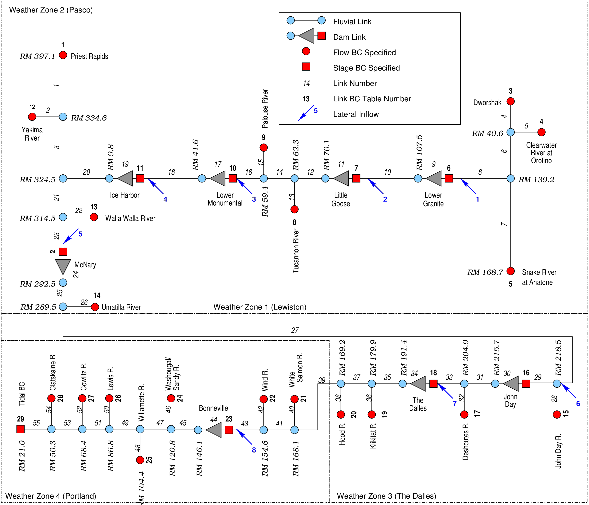
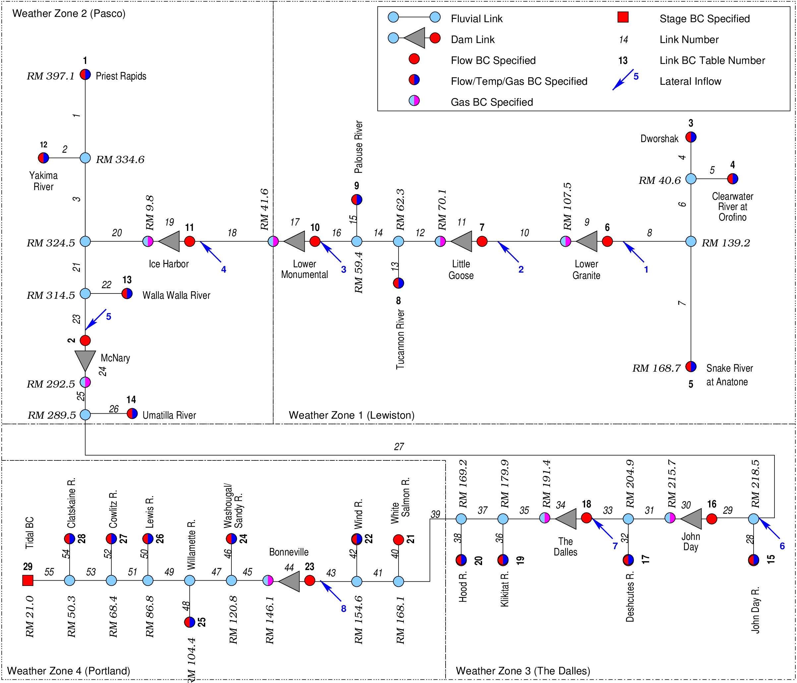

# Dissolved Gas Abatement Study MASS1 Application

This MASS1 application was used as part of the U.S. Corps of
Engineers' Dissolved Gas Abatement Study.  

There are two configurations: 

1. Stage at dams specified as a boundary condition and dam discharge
   allowed to vary unconstrained.  

   

2. Discharge at dams specified as a boundary condition and dam forebay
   stage allowed to vary unconstrained.
   
   

Three years, 1994, 1996, and 1997 were simulated for the spill season
(March 1 to October 1). 

## `StageBCRampdown`

This simulation uses stage specified at the dams, starts from some
arbitrary conditions, and runs to a physically reasonable initial
state.  Simply run MASS1 in this directory, and `restart.dat` will be
produced and available for the other simulations.

## `StageBC`

This uses stage specified at the dams.  This set up was used to
compute lateral inflow to match simulated dam discharge with
observed.  There are several shell scripts that were used to run
MASS1.  These will use the MASS1 executable specified in the `MASS1`
environment variable.  

The script `run-warmups.sh` runs each year from the `StageBCRampdown`
initial condition to March 1.  A
`hotstart-warmup-199?.dat` will be created for each year.  

The script `run-by-year.sh` was used to incrementally compute the
lateral inflow above a dam, then switch the dam from held stage
to held discharge.  This script is included for documentation only. It
used a specific SQL database to compute lateral inflow, and so, won't
work any more.  

The script `run-last.sh` runs each year using the computed lateral
inflow with held stage at dams. It makes some plots comparing observed
and simulated dam discharge as a check. 

## `StageCompare`

This set up was used to calibrate channel roughness to match simulated
dam tailwater stage to observed.  It's basically the same as the
"last" simulation in `StageBC`, but it has its own copy of the point
file (`colpoint-1.test`) that was adjusted independently of the base
point file in `BaseFiles`.  

## References

District, U.S.A.C. of E.P., District, U.S.A.C. of E.W.W., (U.S.),
C.R.F.M.P., 2002. Dissolved Gas Abatement Study: Technical
Report. Phase II. US Army Corps of Engineers. 

Richmond, M.C., Perkins, W.A., Chien, Y., 2000. Numerical Model
Analysis of System-wide Dissolved Gas Abatement Alternatives
(No. PNWD-3245). Battelle Pacific Northwest Division, P.O. Box 999,
Richland, Washington, 99352. 
