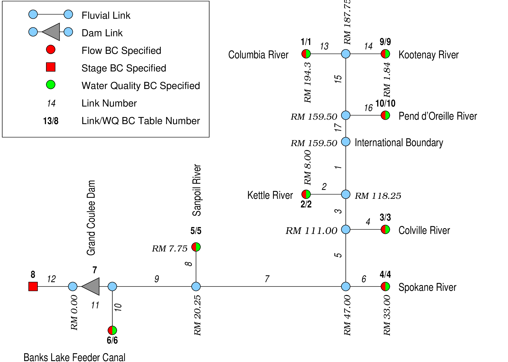
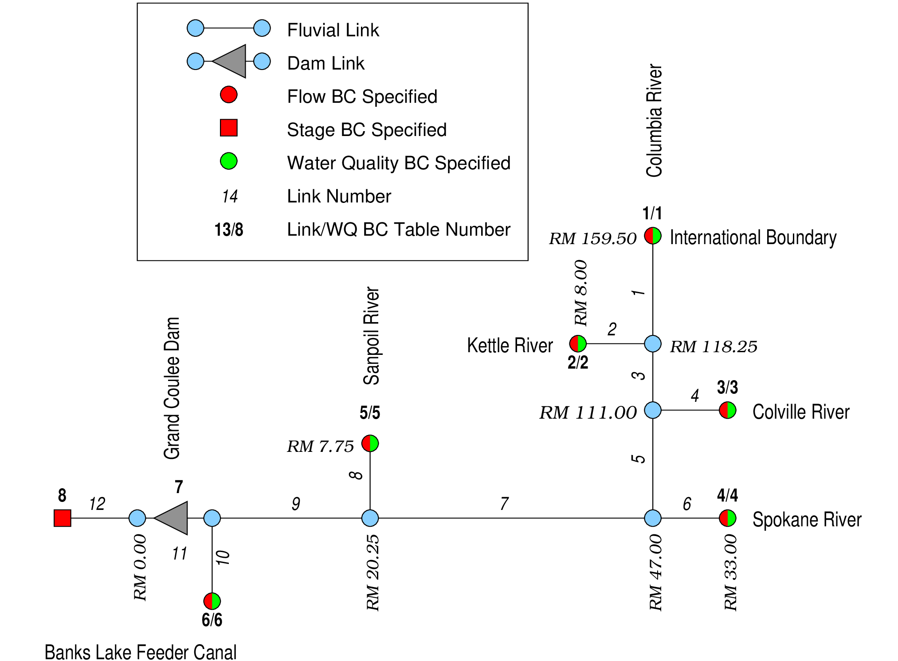

# MASS1 Lake Roosevelt Application

This application was used to simulated hydrodynamics and temperature
in upper Lake Roosevelt (Columbia River impoundment above Grand Coulee
Dam) near the U.S.-Canada border.  Simulation results were used in
the study of white sturgeon movement in early life stages.  

Two configurations were prepared: one with the upstream boundary at [Hugh
Keenleyside Dam](https://en.wikipedia.org/wiki/Keenleyside_Dam);
another with the upstream boundary at the U.S.-Canada border.  

## Canada Configuration

The initial MASS1 configuration included the Columbia River from 
[Grand Coulee Dam](https://www.usbr.gov/pn/grandcoulee/) to [Hugh
Keenleyside Dam](https://en.wikipedia.org/wiki/Keenleyside_Dam). See
the schematic below.  

This was the preferred domain because there are number of sturgeon
spawning areas in the Columbia River above the international border.
Howeven, we were not able to obtain necessary discharge and
temperature data for
[Keenleyside](https://en.wikipedia.org/wiki/Keenleyside_Dam),
[Brilliant](https://en.wikipedia.org/wiki/Brilliant_Dam), and
[Waneta](https://en.wikipedia.org/wiki/Waneta_Dam) dams.  This
configuration was run for some steady discharges (in the
[`Rampdown`](Rampdown) directory), but not used for any
real time period.  

Columbia River bathymetry in Canada was based on navigational charts,
so it's a little sketchy.  There is apparently some good bathymetry
data for many areas, but we were not able to obtain it at the time.  

## International Boundary Configuration

This configuration included the Columbia River from
[Grand Coulee Dam](https://www.usbr.gov/pn/grandcoulee/) to the
U.S.-Canada border. See the schematic below.  Discharge and
temperature data were readily available at the border.  Directories
and files for this configuration are labeled `truncated`.  

This configuration was calibrated/validated for a period in 2016 when
the CCT had several temperature and depth monitors deployed
([`Spring2016.truncated`](Spring2016.truncated)).   After calibration,
21 calendar years (1995-2015) were simulated
([`LongTerm.truncated`](LongTerm.truncated)).  The `dhsvm` MASS1
branch is needed for the long term simulation several short periods of
reverse flow are simulated at Grand Coulee.  The `dhsvm` branch
handles transport with reverse flow correctly, whereas the `master`
branch does not. 

## References

Bellgraph BJ, DR Geist, MC Richmond, WA Perkins, AM Coleman, SF
Harding, and JA Serkowski.  2015.  Lake Roosevelt White Sturgeon
Modeling Support .  PNNL-24635, Pacific Northwest National Laboratory,
Richland, WA.  

Bellgraph BJ, WA Perkins, MC Richmond, JA Serkowski, and SF
Harding.  2016.  Lake Roosevelt White Sturgeon Modeling Support .
PNNL-26056, Pacific Northwest National Laboratory, Richland, WA.  

